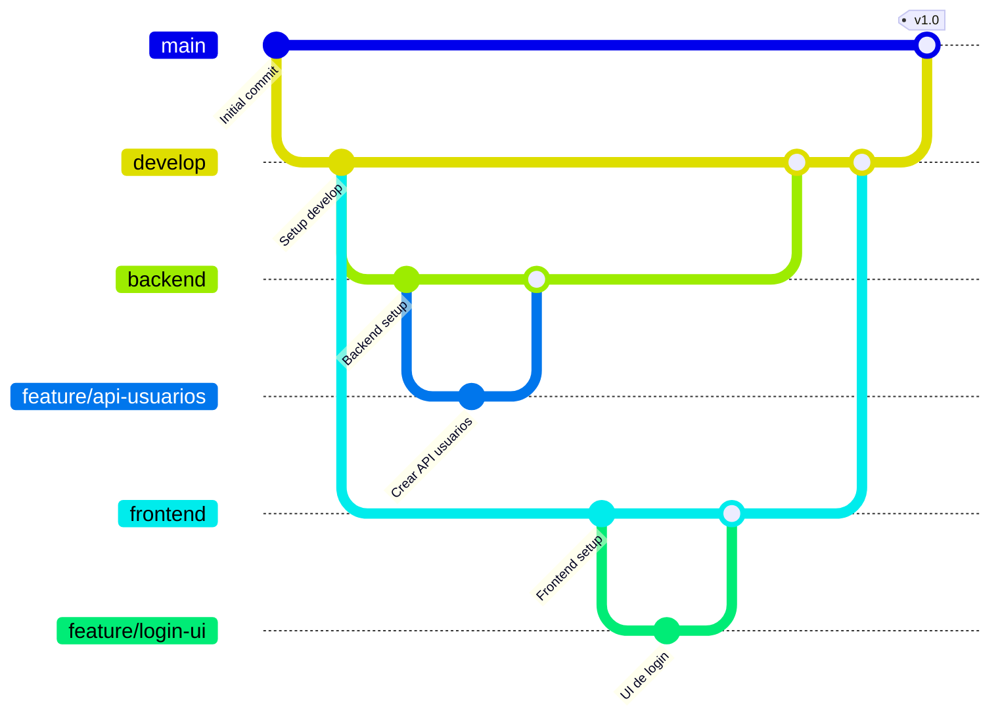

# Estrategia de Ramificación - Proyecto Braille

## 📋 Descripción General

Este documento define la estrategia de ramificación (branching strategy) del proyecto Braille, basada en un modelo de flujo de trabajo estructurado que separa claramente las áreas de desarrollo y garantiza la estabilidad del código entregable.

---

## 🌳 Estructura de Ramas

### **Rama `main` - Versión Estable**
- **Propósito**: Contiene únicamente código 100% probado y listo para entrega.
- **Uso**: Entregas finales, demostraciones a docentes, versiones de producción.
- **Restricción**: ⚠️ **No se trabaja directamente en esta rama**.

### **Rama `develop` - Núcleo de Integración**
- **Propósito**: Punto central donde se integran los cambios de `backend` y `frontend`.
- **Uso**: Laboratorio estable para pruebas de integración antes de pasar a `main`.
- **Flujo**: Recibe cambios mediante Pull Requests desde `backend` y `frontend`.

### **Rama `backend` - Desarrollo del Servidor**
- **Propósito**: Desarrollo de la lógica del servidor, servicios y persistencia.
- **Uso**: Toda la funcionalidad del lado del servidor se desarrolla aquí.
- **Flujo**: Los cambios se integran a `develop` mediante Pull Requests.

### **Rama `frontend` - Desarrollo de la Interfaz**
- **Propósito**: Desarrollo de la interfaz de usuario y experiencia del usuario.
- **Uso**: Toda la funcionalidad del lado del cliente se desarrolla aquí.
- **Flujo**: Los cambios se integran a `develop` mediante Pull Requests.

### **Ramas `feature/*` - Funcionalidades Específicas**
- **Propósito**: Desarrollo de funcionalidades concretas de forma aislada.
- **Nomenclatura**: `feature/nombre-descriptivo` (ejemplo: `feature/login-usuario`)
- **Flujo**: Se crean desde `backend` o `frontend` y se fusionan de vuelta a su rama de origen.
- **Ciclo de vida**: Cortas y enfocadas, se eliminan después de fusionarse.

---

## 🔄 Flujo de Trabajo Completo

```
main (estable, entregable)
 ↑
 │ (PR cuando todo esté probado)
 │
develop (integración de backend + frontend)
 ↑
 ├─────────────┬─────────────┐
 │             │             │
backend    frontend     hotfix/* (emergencias)
 ↑             ↑
 │             │
feature/*   feature/*
(funcionalidades backend) (funcionalidades frontend)
```

### **Diagrama de Flujo Detallado**



---

## 📝 Guía de Uso Paso a Paso

### **1. Trabajar en una nueva funcionalidad del Backend**

```bash
# Asegurarse de estar actualizado
git checkout backend
git pull origin backend

# Crear rama de feature
git checkout -b feature/nombre-funcionalidad

# Desarrollar y hacer commits
git add .
git commit -m "Descripción clara del cambio"

# Subir la rama
git push origin feature/nombre-funcionalidad

# Crear Pull Request: feature/nombre-funcionalidad → backend
```

### **2. Trabajar en una nueva funcionalidad del Frontend**

```bash
# Asegurarse de estar actualizado
git checkout frontend
git pull origin frontend

# Crear rama de feature
git checkout -b feature/nombre-funcionalidad

# Desarrollar y hacer commits
git add .
git commit -m "Descripción clara del cambio"

# Subir la rama
git push origin feature/nombre-funcionalidad

# Crear Pull Request: feature/nombre-funcionalidad → frontend
```

### **3. Integrar Backend/Frontend en Develop**

```bash
# Cuando backend o frontend tengan cambios completos y probados:
# Crear Pull Request desde GitHub:
# - backend → develop
# - frontend → develop

# Revisar, aprobar y fusionar el PR
```

### **4. Preparar una Entrega (Develop → Main)**

```bash
# Cuando develop esté completamente probado y listo:
# Crear Pull Request desde GitHub: develop → main

# Después de fusionar, crear un tag de versión:
git checkout main
git pull origin main
git tag -a v1.0 -m "Primera entrega funcional"
git push origin v1.0
```

---

## ✅ Reglas de Oro

1. **NUNCA hacer commits directos en `main`**
   - Solo se actualiza mediante Pull Requests desde `develop`.

2. **`develop` es el centro de integración**
   - Backend y frontend se prueban juntos aquí antes de ir a `main`.

3. **Las ramas `feature/*` son temporales**
   - Se crean, se usan y se eliminan después de fusionarse.

4. **Siempre hacer Pull Requests**
   - Esto permite revisión de código y documentación de cambios.

5. **Mantener mensajes de commit claros**
   - Usar verbos en infinitivo: "Agregar", "Corregir", "Actualizar", etc.

---

## 🎯 Ventajas de Esta Estrategia

✔ **Estabilidad garantizada**: `main` siempre funciona.
✔ **Trabajo paralelo**: Backend y frontend pueden avanzar sin bloquearse.
✔ **Integración controlada**: Los cambios se prueban antes de llegar a `main`.
✔ **Historial limpio**: Fácil de entender y documentar.
✔ **Profesional**: Cumple con estándares de la industria.

---

## 🚨 Resolución de Conflictos

Si hay conflictos al fusionar:

```bash
# Actualizar tu rama con los últimos cambios
git checkout tu-rama
git pull origin rama-destino

# Resolver conflictos manualmente
# Editar archivos marcados con <<<<<<< HEAD

# Después de resolver:
git add .
git commit -m "Resolver conflictos de fusión"
git push origin tu-rama
```

---

## 📌 Estado Actual del Proyecto

**Ramas existentes:**
- ✅ `main` - Rama principal estable
- ✅ `develop` - **RECIÉN CREADA** - Núcleo de integración
- ✅ `backend` - Desarrollo del servidor
- ⏳ `frontend` - **Pendiente de crear**
- 🧪 `test` - Rama de pruebas (puede eliminarse si no se usa)

**Próximos pasos:**
1. Crear la rama `frontend` cuando se inicie el desarrollo de la interfaz.
2. Migrar el trabajo actual de `backend` a `develop` cuando esté listo.
3. Establecer políticas de Pull Request en GitHub (opcional pero recomendado).

---

## 📚 Referencias

Este flujo está inspirado en:
- **Git Flow**: Modelo estándar de la industria
- **GitHub Flow**: Simplificado para desarrollo continuo
- **Trunk-Based Development**: Para equipos pequeños y ágiles

Adaptado específicamente para las necesidades del proyecto académico Braille.

---

**Documento creado**: Noviembre 24, 2025
**Última actualización**: Noviembre 24, 2025
**Responsable**: Equipo Braille
