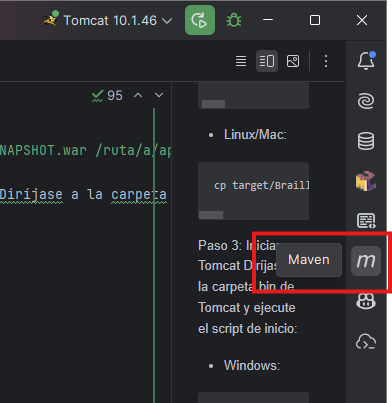
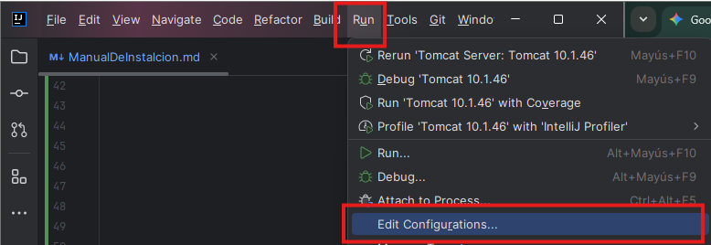
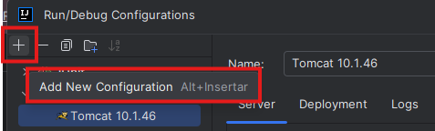
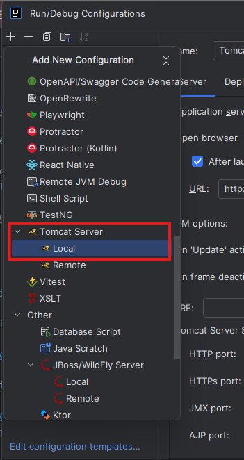
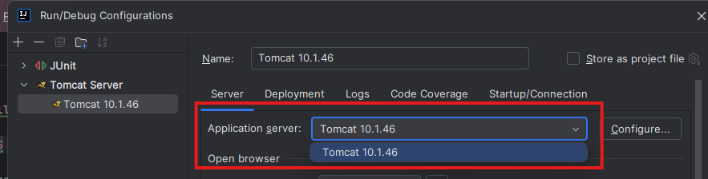
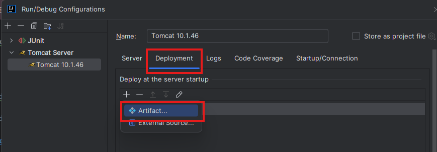
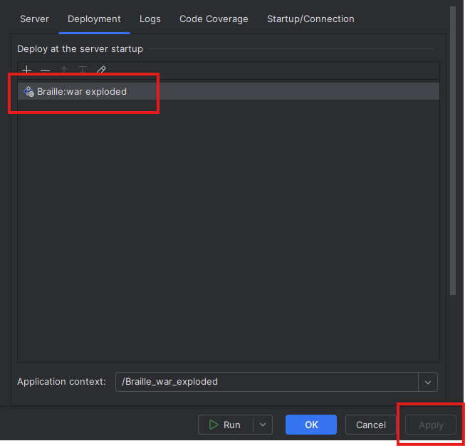
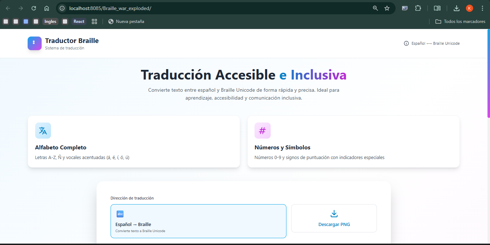
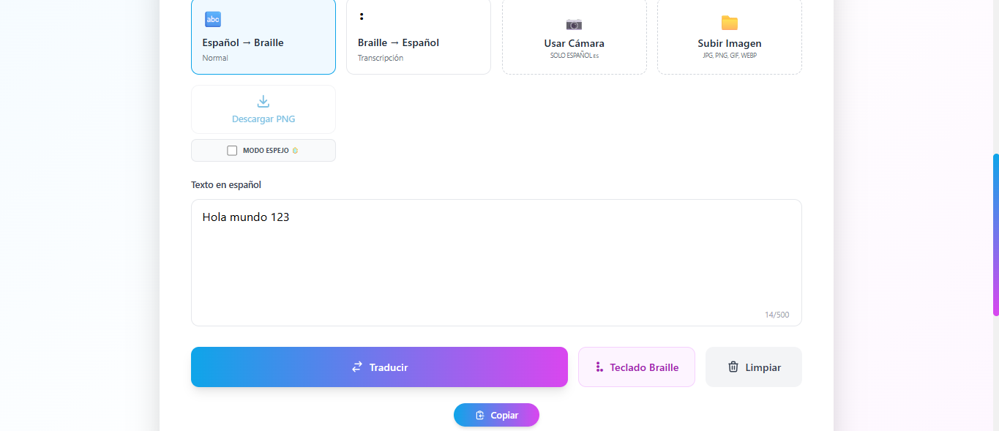

# INTRODUCCIÓN

Este documento detalla los pasos para instalar, configurar y desplegar el "Sistema de Traducción Braille".

# REQUISITOS PREVIOS

Antes de iniciar, asegúrese de tener instaladas las siguientes herramientas en su equipo.
* Java JDK: Versión 8 o superior.
* Apache Maven: Versión 3.6 o superior (Gestor de dependencias).
* Apache Tomcat: Versión 10.1.x (Obligatorio).
* **IDE Recomendado:** IntelliJ IDEA (Community o Ultimate).
* Git: Para clonar el repositorio del proyecto.

# CÓDIGO FUENTE

Abra su terminal o línea de comandos y ejecute:

```
git clone https://github.com/domdume/Braille.git
cd Braille
```
# MÉTODOS DE INSTALACIÓN
Existen dos métodos para instalar el sistema: mediante línea de comandos o utilizando un IDE como IntelliJ IDEA.
## Método 1: Instalación mediante línea de comandos

Paso 1: En la raíz del proyecto, ejecute el siguiente comando para compilar el proyecto y generar el archivo WAR:

```
mvn clean package
```
Paso 2: Mover el Servidor Copie el archivo generado a la carpeta webapps de su instalación de Tomcat.

* Windows:
```
copy target\Braille-1.0-SNAPSHOT.war C:\ruta\a\apache-tomcat-10.1.x\webapps\
```
* Linux/Mac:
```
cp target/Braille-1.0-SNAPSHOT.war /ruta/a/apache-tomcat-10.1.x/webapps/
```
Paso 3: Iniciar Tomcat Diríjase a la carpeta bin de Tomcat y ejecute el script de inicio:

* Windows: 
```
catalina.bat run
```

* Linux/Mac: 
```
./catalina.sh run
```

## Método 2: Instalación utilizando IntelliJ IDEA

Paso 1: Preparación de Artefactos 

Si es la primera vez que abre el proyecto en IntelliJ IDEA, es posible que necesite configurar los artefactos para la construcción del archivo WAR.
1. En la barra lateral derecha, busque la pestaña "Maven".
2. Despliegue el menú del proyecto y busque la carpeta Lifecycle.
3. Ejecute (doble clic) en orden: clean, validate, compile, test y finalmente package.
* Esto asegura que el archivo WAR esté listo para ser desplegado.



Paso 2: Crear la configuración de ejecución

1. Vaya al menú superior y seleccione "Run" > "Edit Configurations".



2. Haga clic en el botón "+" para añadir una nueva configuración y seleccione "Tomcat Server" > "Local".





Paso 3: Configurar el servidor Tomcat
1. En el campo Name, coloque un nombre (ej. "Tomcat 10").
2. En el campo **Application server**, haga clic en "Configure..." y busque la carpeta donde descargó y descomprimió su Apache Tomcat 10.1.x.



Paso 4: Despliegue del Artefacto 
1. En la misma ventana de configuración, vaya a la pestaña **Deployment**.
2. Haga clic en el botón + y seleccione Artifact.
3. Elija la opción Braille:war exploded.
4. Haga clic en Apply y luego en OK.





Paso 5: Ejecutar el Servidor

1. En la barra superior derecha de IntelliJ IDEA, seleccione la configuración que acaba de crear (ej. "Tomcat 10").
2. Haga clic en el botón de reproducción (Run) para iniciar el servidor Tomcat
3. Espere a que el servidor se inicie completamente. Verá mensajes en la consola indicando que el servidor está en funcionamiento.

# VERIFICACIÓN DE LA INSTALACIÓN

Una vez que el servidor esté corriendo (ya sea por IntelliJ o manualmente), abra su navegador web e ingrese a la siguiente dirección:

http://localhost:8085/Braille_war_exploded/


